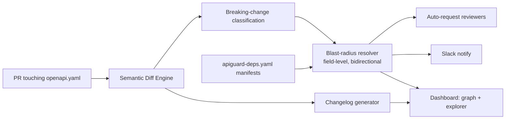

# 🛡️ Wakegraph

**See the blast radius of an API change across your MuleSoft estate.** Change a RAML/OpenAPI spec
and Wakegraph tells you the **blast radius before you merge** — mapped from your *real* dependency
network (Exchange + API Manager + Bitbucket/GitHub repo flows) — and documents it automatically.

Three features on one pipeline (the semantic diff):

1. **Breaking-Change Detector** — diffs old vs new OpenAPI and classifies every change
   `BREAKING` / `SAFE` / `ADDITIVE`. No AI, no heuristics — explicit, testable rules. Every
   breaking change comes with a **"Ship it safely"** fix: the concrete, backward-compatible way
   to make the same change (deprecate-then-remove, add-optional-with-default, version the endpoint).
2. **Blast-Radius Reviewer** — maps changed endpoints/fields to impacted consumers and owners,
   **field-level and bidirectional** (downstream consumers *and* upstream sources), from
   declarative manifests. Auto-requests the right cross-team reviewers and Slack-notifies.
3. **Self-Writing Changelog** — renders the classified diff into a categorized Markdown changelog
   (Breaking / Added / Changed / Removed) with migration notes.

Works on **any OpenAPI-driven org**, not just MuleSoft. The detector and changelog need **zero
manifests** — two of three features work the moment you point it at two specs.

---

## Why it's one product

All three features consume the same semantic diff. Change one shared API →
*"here's who breaks, here are the reviewers, here's the changelog."*



---

## Quickstart

### 1. The CLI (zero infrastructure)

```bash
./gradlew :cli:shadowJar
JAR=cli/build/libs/apiguard.jar

# Classify changes + generate a changelog
java -jar $JAR diff samples/orders-api/openapi-v1.yaml samples/orders-api/openapi-v2.yaml --changelog

# Add blast radius from manifests; exits non-zero on breaking changes hitting real consumers
java -jar $JAR check samples/orders-api/openapi-v1.yaml samples/orders-api/openapi-v2.yaml \
     --api orders-api --manifests samples/manifests
```

```
BREAKING   GET /orders/{id}  response.200.customerId  (Response field 'customerId' removed)
  down  2 consumers may break:
      - billing-service   team=billing        reviewers=carol   slack=#billing-alerts
      - orders-web        team=web-checkout   reviewers=alice,bob
  up    sourced from:
      - customers-api  GET /customers/{id}.id
SAFE       POST /orders  request.couponCode  (New optional request field 'couponCode')
  down  1 consumer depends on this (safe)

2 breaking change(s) affecting 2 consumer(s) -> exit 1
```

Drop `apiguard check` into a **pre-commit hook** or CI to gate breaking changes.

When a Wakegraph server is running with your synced estate, use `impact` instead — the blast radius
then comes from the *real* dependency network (Anypoint contracts + every scanned repo), not just
the manifests in this checkout, and you get a PR-ready Markdown report:

```bash
java -jar apiguard.jar impact old.yaml new.yaml --api orders-exp-api \
    --server https://wakegraph.internal --markdown report.md
# exit 1 only when a breaking change hits a real consumer (--fail-on breaking|never to change)
```

### 2. The server + dashboard (no Docker needed)

```bash
# In-memory H2, demo data seeded automatically
./gradlew :server:bootRun --args='--spring.profiles.active=dev'
# → REST API on http://localhost:8080  (try /api/graph, /api/changelog, /api/apis)

cd dashboard && flutter run -d chrome     # dashboard talks to :8080
```

### Securing the server (optional)

Set `apiguard.security.api-key` (or env `APIGUARD_API_KEY_SERVER`) and every `/api/*` call must
send the key as `X-API-Key: <key>` or `Authorization: Bearer <key>`:

```bash
./gradlew :server:bootRun --args='--apiguard.security.api-key=my-secret'
```

The CLI picks the key up from `--api-key` or `$APIGUARD_API_KEY`; in the dashboard, click the key
icon in the sidebar (stored only in your browser). Leave the property unset for local use — auth
is off by default.

### 3. Everything in Docker (Postgres + server + dashboard)

```bash
cp deploy/.env.example deploy/.env        # optional: add GITHUB_TOKEN / SLACK_WEBHOOK_URL
docker compose -f deploy/docker-compose.yml up --build
# Dashboard → http://localhost:8090   API → http://localhost:8080
```

### 4. As a GitHub Action

```yaml
# .github/workflows/apiguard.yml
- uses: actions/checkout@v4
  with: { fetch-depth: 0 }
- run: git show "${{ github.event.pull_request.base.sha }}:openapi.yaml" > /tmp/old.yaml
- uses: MadhavChhabra/Mule-Blast-Radius-Tracker/action@main
  with:
    old-spec: /tmp/old.yaml
    new-spec: openapi.yaml
    api: orders-api
    manifests: .
    fail-on-breaking: 'true'
    # server: https://wakegraph.internal   # optional — blast radius from the real synced estate
```

It comments the report on the PR and fails the check when breaking changes are found. With
`server` set, the comment is the full estate-aware impact report (risk score, consumers, owners,
reviewers, changelog).

---

## The heart: breaking-change rules

The engine's governing principle is **request/response asymmetry**:

> Widening what the server **accepts** (request) is safe. Widening what it **returns** (response)
> can break strict consumers. **Narrowing either side is breaking.**

| Change | Request side | Response side |
|---|---|---|
| Field added (optional) | ✅ additive | ✅ additive |
| Field added (required) | ❌ **breaking** | — |
| Field removed | safe (server accepts less) | ❌ **breaking** |
| Field made required | ❌ **breaking** | — |
| Type changed / narrowed | ❌ **breaking** | ❌ **breaking** |
| Enum value **added** | ✅ additive (accepts more) | ❌ **breaking** (may return new value) |
| Enum value **removed** | ❌ **breaking** (rejects old input) | safe (returns fewer) |
| Field becomes nullable | (narrowing → breaking) | ❌ **breaking** |
| Auth added / tightened | ❌ **breaking** | — |
| Endpoint / operation removed | ❌ **breaking** | — |

Also handles `$ref` resolution, nested objects/arrays, `oneOf`/`anyOf`/`allOf`, path parameters,
and response status codes. **Every rule has a unit test with a tiny before/after spec pair** — see
[`core/src/test/.../DiffEngineTest.java`](core/src/test/java/com/apiguard/core/diff/DiffEngineTest.java).

---

## Manifests (`apiguard-deps.yaml`)

Blast radius is powered by declarative manifests each consumer commits to its own repo:

```yaml
consumer: orders-web
owner_team: web-checkout
reviewers: [ "gh:alice", "gh:bob" ]
slack_channel: "#checkout-alerts"
depends_on:
  - api: orders-api
    endpoints:
      - path: "GET /orders/{id}"
        fields: [ "customerId", "status" ]
```

Optional **upstream lineage**, declared by a producer, enables two-way tracing:

```yaml
api: orders-api          # apiguard-sources.yaml
sources:
  - endpoint: "GET /orders/{id}"
    field: "customerId"
    from: { api: customers-api, endpoint: "GET /customers/{id}", field: "id" }
```

Manifests are simple, explicit, versioned in git, and reviewable. Blast radius is only as good as
manifest coverage — but the detector + changelog need none, so you get value on day one.

---

## Dashboard

Five surfaces over the REST API (Flutter Web):

- **Home** — estate health at a glance (layer counts, breaking edges, most depended-on APIs) plus
  governance findings. First run walks you through connecting a source.
- **Sources** — connect your Anypoint org and add Bitbucket/GitHub repos (or a whole org), then
  **Sync everything** in one click.
- **Estate map** — the API-led dependency network (apps → experience → process → system → systems
  of record); edges coloured by risk. Click any node to open it.
- **API hub** — everything about one API in four tabs: **Endpoints** (what each calls and who
  calls it), **Change impact** (*Who reads a field* and *Check a change* — the latter shows what
  breaks, how to **ship it safely**, the version bump, risk, who's affected, and a changelog),
  **Consumers & blast radius**, and **Spec & history**.
- **Changelog** — the auto-generated Markdown history.

Press **Ctrl/Cmd-K** anywhere to jump to any API, endpoint, or field.

---

## REST API

| Method | Path | Purpose |
|---|---|---|
| `POST` | `/api/analyze` | Diff two specs → classified changes + blast radius + changelog (persists) |
| `GET`  | `/api/apis` | List analyzed APIs |
| `GET`  | `/api/apis/{name}/changes` | Recorded changes for an API |
| `GET`  | `/api/changelog?api=` | Changelog history |
| `GET`  | `/api/graph` | Dependency graph (nodes + risk-coloured edges) |
| `GET`  | `/api/explorer?api=&endpoint=&field=` | Pre-change downstream + upstream |
| `POST` | `/api/manifests/dependency` | Ingest a consumer manifest (YAML body) |
| `POST` | `/api/manifests/source` | Ingest producer upstream lineage |
| `POST` | `/webhooks/github` | GitHub `pull_request` webhook (HMAC-verified) |

---

## Project layout

```
core/        # pure Java: SpecLoader, DiffEngine, ChangelogGenerator, BlastRadiusResolver
cli/         # Picocli: apiguard diff / apiguard check   (fat jar via shadowJar)
server/      # Spring Boot: REST API, JPA + Flyway, webhook, Slack/GitHub notifiers
dashboard/   # Flutter Web (graphview + fl_chart)
action/      # composite GitHub Action
deploy/      # docker-compose + .env.example
samples/     # sample specs + manifests (also seeded into the dev server)
```

`core/` has no Spring/HTTP dependencies, so the CLI and server both reuse it.

---

## Tests

```bash
./gradlew build                 # core + cli + server (JUnit 5, H2)
cd dashboard && flutter test    # widget test
```

- `core` — rule-by-rule diff tests, changelog, blast-radius resolver.
- `server` — full Spring integration (Flyway migration on H2) + MockMvc web-layer tests.

---

*Built from a single build brief. `Wakegraph` (formerly APIGuard, then briefly FlowSight) is the product name; internal identifiers remain `apiguard`.*
